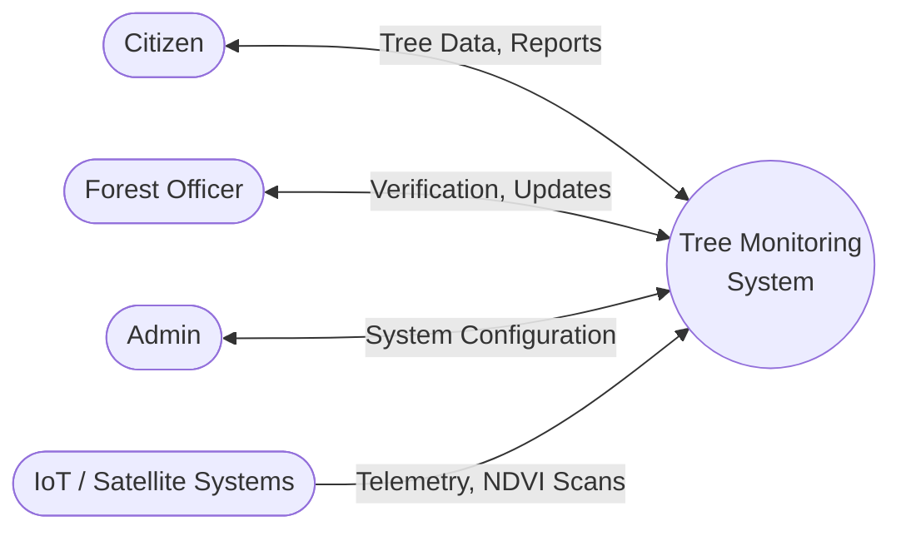
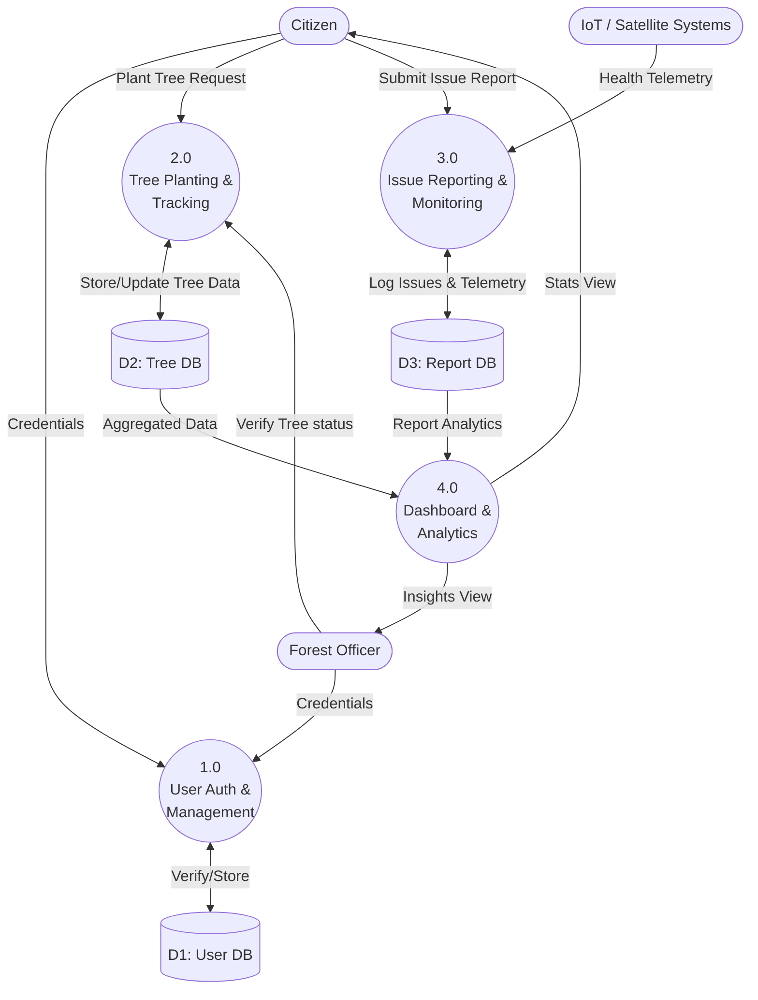
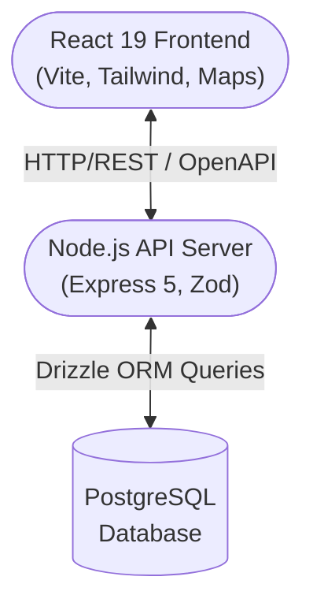
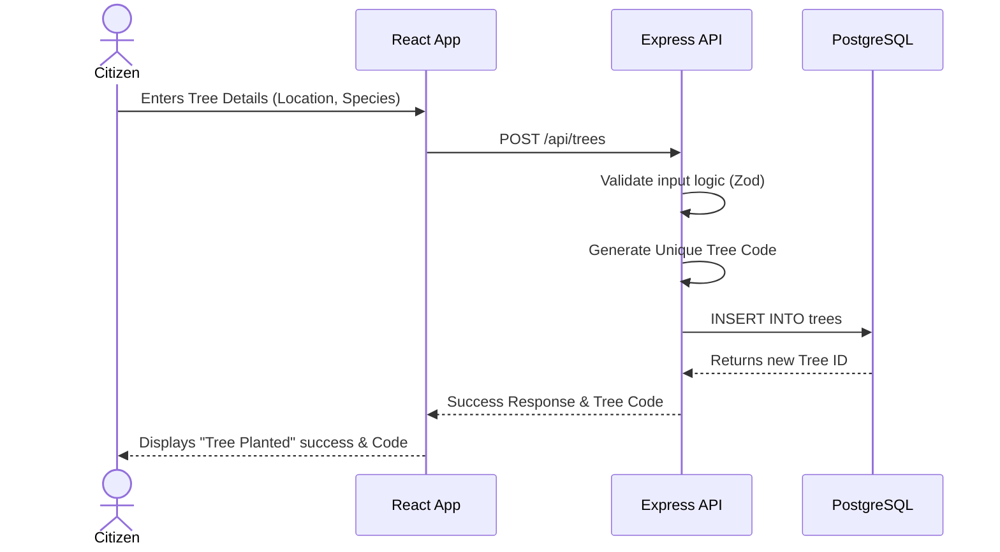
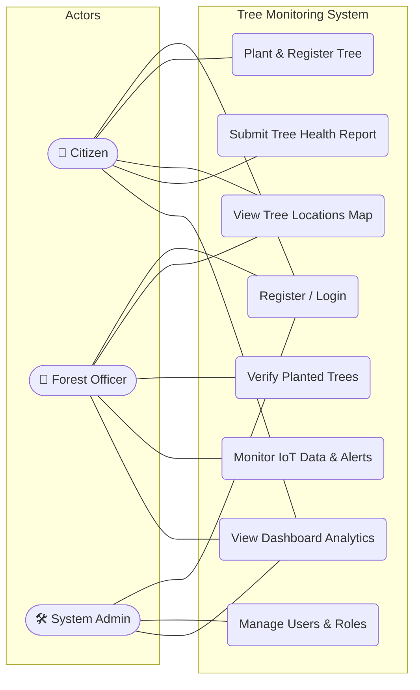
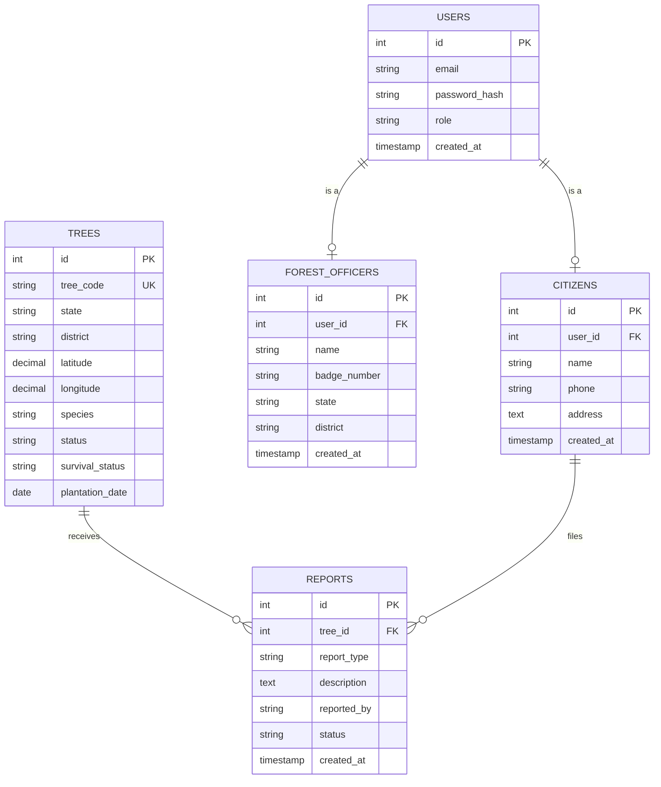

# 🌳 Dot-Explorer — Tree Monitoring System

A full-stack tree plantation and monitoring platform built for India's forest conservation efforts. Track plantations, detect deforestation using satellite NDVI data, log IoT sensor readings, run AI-based image analysis, and maintain blockchain-style tamper-proof audit trails.

---

## 🏗️ System Architecture & Logic Flow

### 1. Context & Data Flow (DFD)

**Level 0 (Context Diagram):**


**Level 1 (Sub-processes):**


### 2. Implementation Tech Stack



### 3. Tree Plantation Flow (Sequence)



### 4. Use Case Interactions



### 5. Database Schema (ERD)



---

## 🚀 Prerequisites

Before starting, make sure you have the following installed:

| Tool          | Version   | Install Guide |
|---------------|-----------|---------------|
| **Node.js**   | ≥ 18.x    | [nodejs.org](https://nodejs.org/) |
| **pnpm**      | ≥ 8.x     | `npm install -g pnpm` |
| **PostgreSQL**| ≥ 14.x    | [postgresql.org](https://www.postgresql.org/download/) |

---

## 🛠️ Setup Guide

### 1. Clone the Repository

```bash
git clone https://github.com/your-username/Dot-Explorer.git
cd Dot-Explorer
```

### 2. Install Dependencies

```bash
pnpm install
```

### 3. Set Up PostgreSQL Database

```bash
node setup-db.mjs
```
*(Alternatively, create the `tree_monitor` database manually via `psql`)*

### 4. Push Database Schema (Drizzle)

```bash
pnpm db:push
```

### 5. Start Development

```bash
# Start both backend and frontend concurrently
pnpm dev
```

---

## 🔧 Common Commands

```bash
pnpm install        # Install dependencies
pnpm dev            # Start development (backend + frontend)
pnpm dev:backend    # Start only backend
pnpm dev:frontend   # Start only frontend
pnpm build          # Build workspace
pnpm typecheck      # Type check all packages
pnpm db:push        # Push database schema
```

---

## 📝 License

MIT
